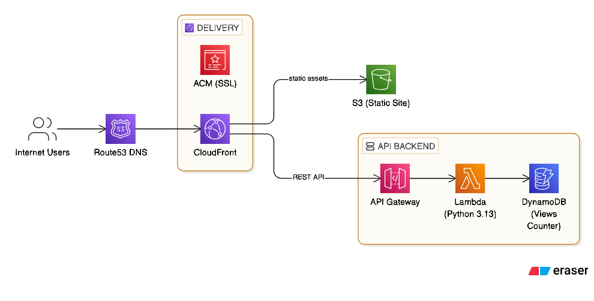

```markdown
# AWS Cloud Resume Challenge

> A serverless resume website with real-time visitor counter, built entirely on AWS with IaC and CI/CD.



[](https://github.com/[username]/[repo]/actions)
[](https://github.com/[username]/[repo]/actions)

## 🎯 Challenge Overview

The Cloud Resume Challenge is a hands-on project that demonstrates cloud, DevOps, and software development skills by building a personal resume website with the following requirements:

1. ✅ Static website (HTML/CSS/JavaScript)
2. ✅ Hosted on AWS S3
3. ✅ HTTPS via CloudFront
4. ✅ Custom domain with DNS
5. ✅ Visitor counter using JavaScript
6. ✅ API Gateway + Lambda backend
7. ✅ DynamoDB for data storage
8. ✅ Python for Lambda function
9. ✅ Tests (unit + integration)
10. ✅ Infrastructure as Code (Terraform)
11. ✅ CI/CD pipeline (GitHub Actions)

## 🏗️ Architecture

```
┌─────────────────────────────────────────────────────────────────┐
│                         Internet Users                          │
└────────────────────────────┬────────────────────────────────────┘
                             │
                             ▼
                  ┌──────────────────────┐
                  │     Route53 DNS      │
                  │ animals4life.shop    │
                  └──────────┬───────────┘
                             │
                             ▼
              ┌──────────────────────────────┐
              │   CloudFront Distribution    │
              │   (HTTPS + Custom Domain)    │
              │   + ACM Certificate          │
              └──────────┬───────────────────┘
                         │
         ┌───────────────┴────────────────┐
         │                                │
         ▼                                ▼
  ┌─────────────┐              ┌──────────────────┐
  │  S3 Bucket  │              │   API Gateway    │
  │  (Static    │              │  (REST API)      │
  │   Site)     │              └────────┬─────────┘
  └─────────────┘                       │
                                        ▼
                              ┌──────────────────┐
                              │  Lambda Function │
                              │   (Python 3.13)  │
                              └────────┬─────────┘
                                       │
                                       ▼
                              ┌──────────────────┐
                              │    DynamoDB      │
                              │  (Views Counter) │
                              └──────────────────┘
```

**Key Components:**

- **Frontend:** HTML5UP Strata template, hosted in S3
- **CDN:** CloudFront with Origin Access Control (OAC)
- **DNS:** Route53 with custom domain
- **SSL:** ACM certificate (us-east-1 for CloudFront)
- **Backend:** Python Lambda + DynamoDB
- **API:** API Gateway with Lambda Function URL
- **IaC:** Terraform for all infrastructure
- **CI/CD:** GitHub Actions for automated testing and deployment

## 💻 Tech Stack

**Frontend:**
- HTML5, CSS3, JavaScript (Vanilla)
- HTML5UP Strata template

**Backend:**
- Python 3.13
- boto3 (AWS SDK)

**Infrastructure:**
- AWS S3 (static hosting)
- AWS CloudFront (CDN)
- AWS Lambda (serverless compute)
- AWS DynamoDB (NoSQL database)
- AWS API Gateway (REST API)
- AWS Route53 (DNS)
- AWS ACM (SSL certificates)

**DevOps:**
- Terraform 1.6+ (Infrastructure as Code)
- GitHub Actions (CI/CD)
- pytest + moto (testing)

## 📁 Project Structure

```
.
├── .github/
│   └── workflows/
│       ├── backend-cicd.yml     # Backend CI/CD pipeline
│       └── frontend-cicd.yml    # Frontend deployment
├── terraform/
│   ├── main.tf                  # Main infrastructure
│   ├── provider.tf              # AWS provider config
│   ├── variables.tf             # Variables
│   ├── outputs.tf               # Outputs
│   └── lambda/
│       └── func.py              # Lambda function code
├── lambda/
│   ├── func.py                  # Lambda source (for testing)
│   └── tests/
│       ├── test_func.py         # Unit tests
│       ├── conftest.py          # Pytest fixtures
│       └── pytest.ini           # Pytest config
├── tests/
│   └── integration/
│       └── test_api.py          # Integration tests
├── html5up-strata/              # Frontend code
│   ├── index.html
│   ├── assets/
│   └── ...
├── diagrams/
│   └── architecture.png         # Architecture diagram
├── docs/
│   ├── SETUP.md                 # Setup instructions
│   ├── SECURITY.md              # Security considerations
│   └── TROUBLESHOOTING.md       # Common issues
└── README.md                    # This file
```

## 🚀 Key Features

### **Frontend**
- Responsive design (mobile-first)
- Fast loading (<1s on CloudFront)
- Custom domain with HTTPS
- Real-time visitor counter

### **Backend**
- Serverless architecture (no server management)
- Atomic DynamoDB operations (thread-safe counter)
- CORS support for cross-origin requests
- Comprehensive error handling

### **Infrastructure**
- 100% Infrastructure as Code (Terraform)
- Multi-region setup (ap-south-1 + us-east-1)
- Secure access patterns (CloudFront OAC, no public S3)
- Cost-optimized (<₹100/month)

### **CI/CD**
- Automated testing (unit + integration)
- Automated deployments on push to main
- PR validation with Terraform plan
- CloudFront cache invalidation

## 🧪 Testing

### **Unit Tests**
```bash
cd lambda
pytest tests/ -v --cov=func --cov-report=term-missing
```

**Coverage:** 90%+

Tests include:
- DynamoDB operations (mocked with moto)
- Lambda handler logic
- CORS headers
- Error handling
- Edge cases

### **Integration Tests**
```bash
pytest tests/integration/ -v
```

Tests verify:
- Lambda Function URL responds
- DynamoDB table exists with correct schema
- S3 bucket contains files
- CloudFront distribution is active
- Route53 DNS is configured
- ACM certificate is valid

## 📊 Performance & Metrics

- **Page Load Time:** <500ms (via CloudFront)
- **API Response Time:** <200ms (Lambda cold start: ~1s)
- **Uptime:** 99.9% (AWS SLA)
- **Cost:** ~₹80/month in production
  - CloudFront: ₹30
  - Route53: ₹35
  - Lambda/DynamoDB: Free tier
  - S3: ₹5

## 🔒 Security

See [security.md](docs/security.md) for more details.

## 🛠️ Local Development

### **Prerequisites**
- AWS CLI configured with credentials
- Terraform 1.6+
- Python 3.13+
- Node.js 18+ (for frontend local dev)

### **Setup**
See [setup.md](docs/setup.md) for more details.

## 🚢 Deployment

See [deployment.md](docs/deployment.md) for more details.

## 🐛 Troubleshooting

See [TROUBLESHOOTING.md](docs/TROUBLESHOOTING.md) for more details.

## 📚 What I Learned

**AWS Services:**
- S3 static website hosting vs. CloudFront OAC
- CloudFront distribution configuration
- Lambda Function URLs vs. API Gateway
- DynamoDB single-table design
- Route53 DNS management
- ACM certificate provisioning and validation

**DevOps:**
- Terraform state management (local vs. remote)
- GitHub Actions workflow design
- Automated testing strategies
- CI/CD best practices

**Development:**
- Python Lambda handler patterns
- DynamoDB atomic operations
- CORS configuration
- pytest with moto for AWS mocking

**Challenges Overcome:**
1. CloudFront OAC configuration (vs. legacy OAI)
2. Multi-region Terraform setup (different regions for services)
3. DynamoDB schema design (single item counter)
4. GitHub Actions secrets management
5. Cost optimization (avoid unnecessary charges)

## 📈 Future Improvements

- [ ] Add CloudWatch dashboard for monitoring
- [ ] Implement CloudWatch alarms for errors
- [ ] Add API rate limiting with WAF
- [ ] Implement blue-green deployment
- [ ] Add performance monitoring (X-Ray)
- [ ] Migrate to Terraform Cloud for remote state
- [ ] Add custom error pages in CloudFront
- [ ] Implement automated backup strategy
- [ ] Add detailed visitor analytics
- [ ] Create multi-environment setup (dev/staging/prod)

## 🔗 Resources

- [Cloud Resume Challenge](https://cloudresumechallenge.dev/)
- [AWS Well-Architected Framework](https://aws.amazon.com/architecture/well-architected/)
- [Terraform AWS Provider Docs](https://registry.terraform.io/providers/hashicorp/aws/latest/docs)
- [My Blog Post: Building the Cloud Resume Challenge](link-to-medium-article)

## 📄 License

This project is open source and available under the [MIT License](LICENSE).

## 👤 Author

**[Your Name]**
- GitHub: [@username](https://github.com/username)
- LinkedIn: [Your Profile](https://linkedin.com/in/yourprofile)
- Portfolio: [Coming Soon]

---

⭐ If you found this helpful, please star the repo!

📝 Questions? Open an issue or reach out on LinkedIn.

🚀 Part of my journey to build 20+ cloud projects.
```